# Portfolio

# Laiba's Portfolio

A fully responsive personal portfolio website showcasing my **skills**, **education**, and **projects**. It features a **sidebar** for profile details, a **navigation bar** for quick section access and smooth **animations** for a modern, interactive experience

## Features

1. **Responsive Layout**

   - **Mobile-first approach**
   - **Bootstrap’s grid** and **flexbox** ensure fluid responsiveness

2. **Navigation Bar**

   - **Desktop**: Fixed navbar at the top or alongside the sidebar
     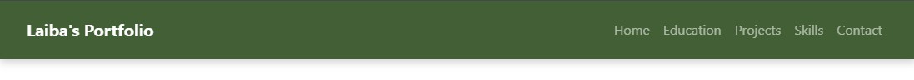

   - **Mobile**: Hamburger menu (☰) that slides down or from the side
     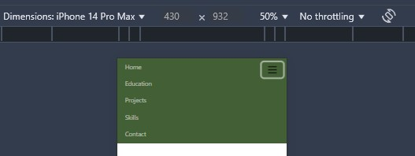
   - **Links**: Home, Education, Projects, Skills, Contact
     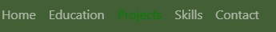

3. **Sidebar**

   - **Desktop**: Visible by default, displaying name, email, and phone
     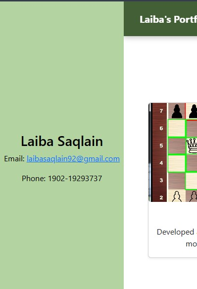
   - **Mobile**: Collapsible with a toggle button, sliding in/out smoothly
     

4. **Home Section**

   - **Circular Profile Picture** with hover animation
     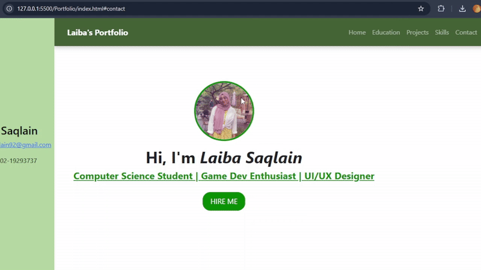

   - **Headline & Tagline**: Large, bold text for name and short description
     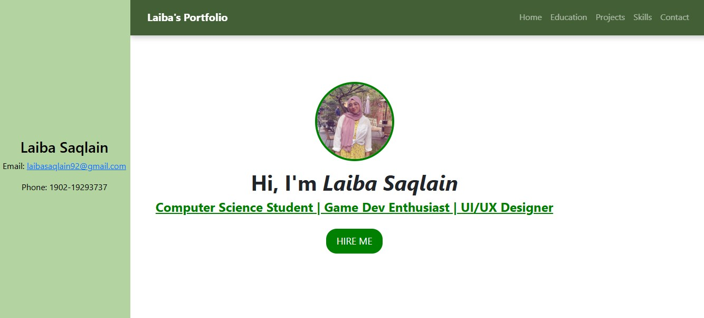
   - **“Hire Me” Button** linking to the Contact section
     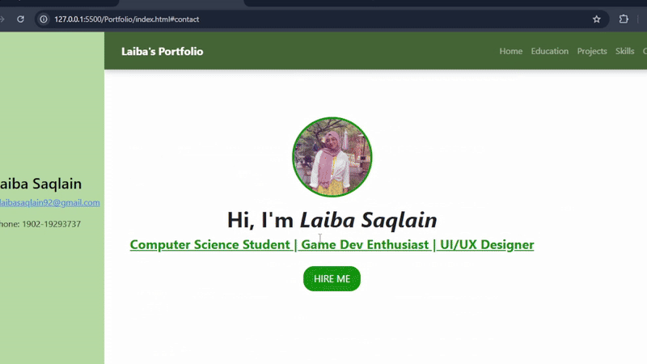

5. **Education Section**

   - **Fancy Bootstrap table** (`.table-striped`, `.table-dark`)
   - Custom theme colors for alternating row stripes
     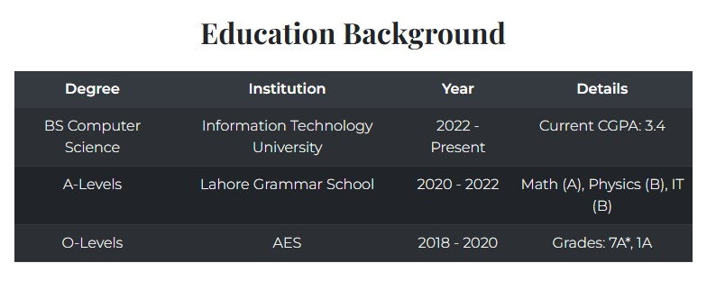

6. **Projects Section**

   - **Cards** with hover effects (shadows & scale)
     
   - **Row/Grid layout** with Bootstrap columns
   - Showcases project images, titles, and brief descriptions
     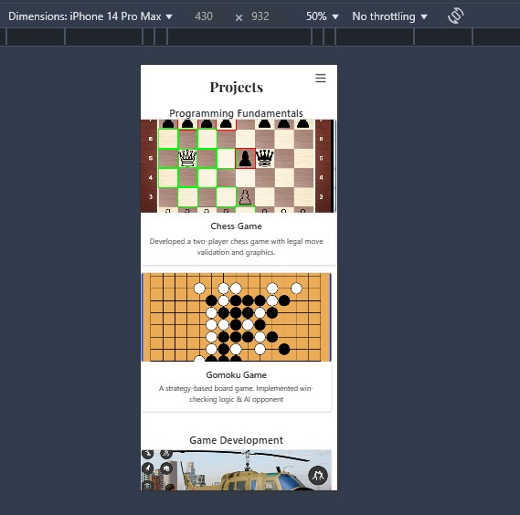

7. **Skills Section**

   - **Animated progress bars** (CSS keyframes)
     
   - Bars can expand, stay filled, and contract on a loop

8. **Contact Section**

   - **Bootstrap form** with validation
   - Fields: Name, Email, Message
     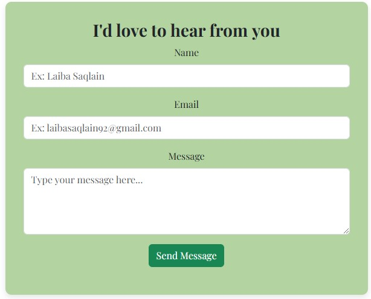
   - **Success/Failure alerts** upon submission
     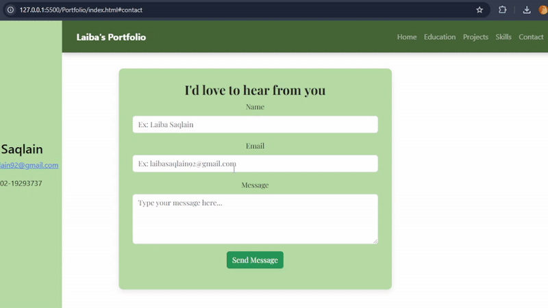
   - Smooth scroll from the “Hire Me” button or navbar link
     
